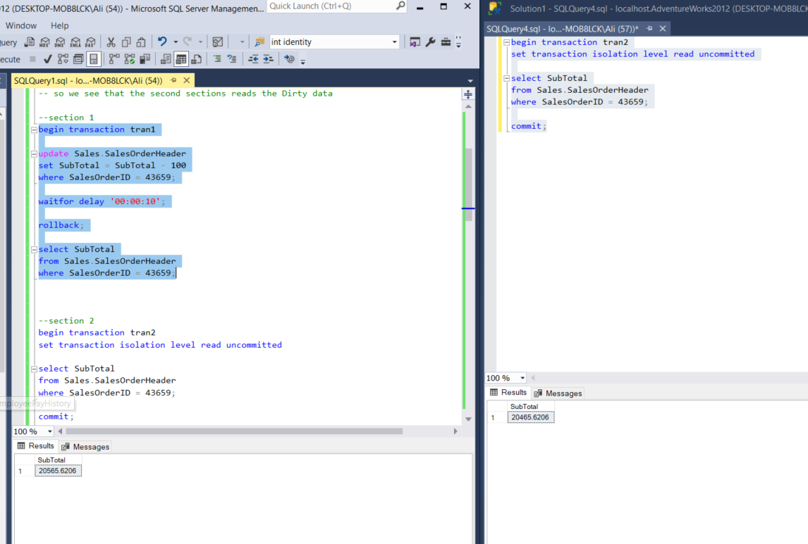
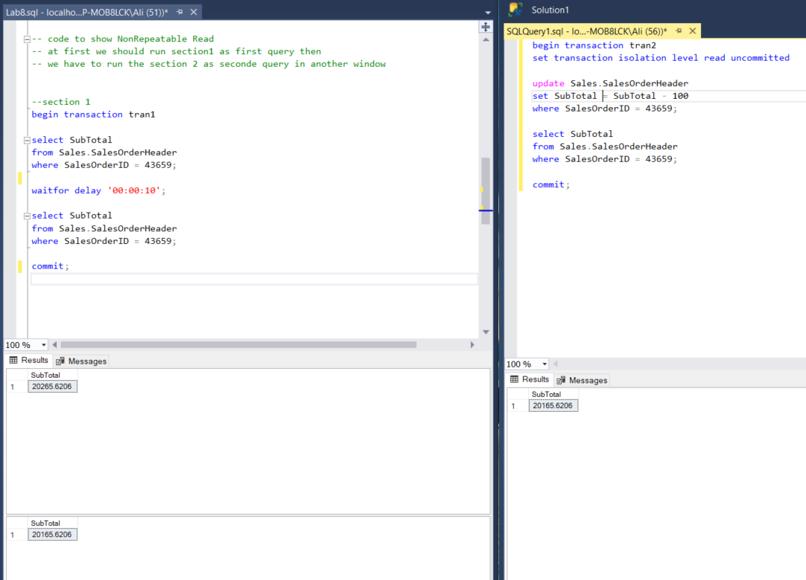

# DB_Lab_IUT
# **LAb 8**
In this section three main points are discussed :
- Dirty read
- NonRepeatable read
- 
as we see in the picture below we read the Dirty data in the second transaction:

here we see the non repeatable read problems as the data we select in first transaction had been changed via transaction2

